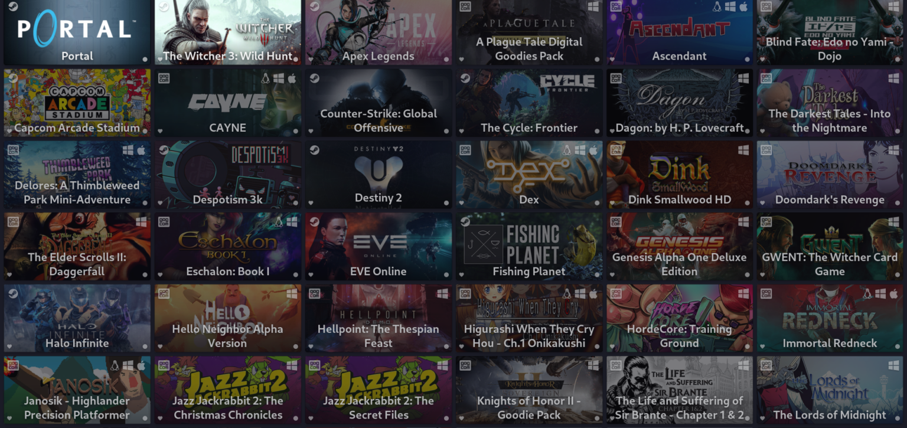
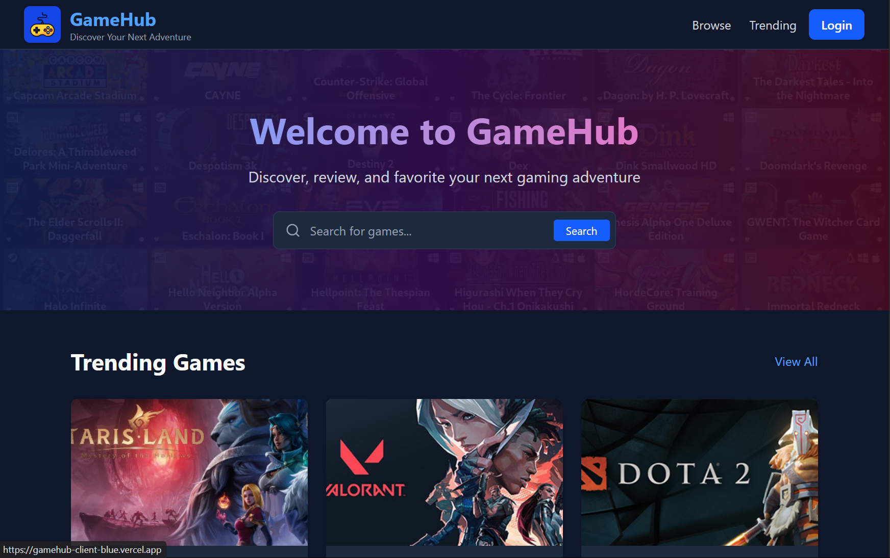

  
  <h1>GameHub</h1>
  
<strong>Your Gateway to Gaming Discovery</strong>

  
  
  

  

## ✨ Discover, Play, Connect

**GameHub** brings the world of free-to-play games to your fingertips with a beautifully designed platform that helps you:

- 🎮 **Discover amazing games** across PC, browser, and mobile
- ⭐ **Track your favorites** and build your personal gaming collection
- 📝 **Share your opinions** through ratings and reviews
- 🔍 **Find hidden gems** with our advanced filtering and search

## 🚀 Features That Set Us Apart

  <table>
    <tr>
      <td align="center"><b>🌠Cross-Platform</b> Find games for Windows, browser, and mobile</td>
      <td align="center"><b>👤 Personalized</b> Curated recommendations based on your taste</td>
      <td align="center"><b>🔄 Always Fresh</b> Constantly updated game library</td>
    </tr>
  </table>

## 💻 Modern Tech Stack

  
  
  
  
  

## 🎯 Perfect For:

- 🎮 **Gamers** looking to discover new free-to-play titles
- 🧐 **Content Creators** researching trending games
- 💻 **Developers** showcasing their games to a passionate audience
- 🌟 **Communities** sharing recommendations and reviews

## 🌟 Try GameHub Today!

  <a href="https://gamehub-client.vercel.app" style="padding: 10px 20px; background: #6366F1; color: white; text-decoration: none; border-radius: 5px; font-weight: bold; display: inline-block; margin: 20px 0;">EXPLORE GAMES NOW</a>

---

  
GameHub is open source under the <a href="LICENSE">MIT License</a>

  
  <a href="#top">Back to top ⬆️</a>

